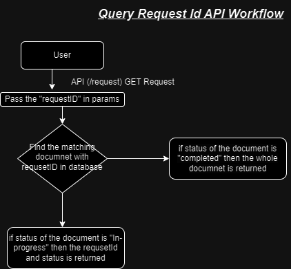

# Image Processing System Design

## 1. Introduction

The system processes CSV files to extract image URLs, processes the images, and triggers a webhook notification once the processing is complete.

## 2. Requirements

### Functional Requirements:

- Process CSV files to extract image URLs.
- Download images and process them (e.g., compress and upload).
- Trigger a webhook notification with the processing results.

## 3. Visual diagram of the system

- Upload & Webhook API Workflow 
- Query Processing API Workflow 

## 4. Components

### CSV File Processor:

- **Function**: Reads CSV files, extracts image URLs, and triggers image processing.
- **Inputs**: CSV files uploaded via an API.
- **Outputs**: Processed image URLs and metadata.
- **Responsibilities**:
  - Parse CSV files.
  - Validate and extract image URLs.
  - Call image processing services.

### Image Processing Service:

- **Function**: Downloads, processes (e.g., compresses), and uploads images.
- **Inputs**: Image URLs from CSV.
- **Outputs**: URLs of processed images.
- **Responsibilities**:
  - Download images from provided URLs.
  - Apply transformations (e.g., compression).
  - Upload images to a cloud service (e.g., Cloudinary).

### Webhook Handling:

- **Function**: Receives processing results and sends notifications.
- **Inputs**: Processed data (e.g., image URLs, status).
- **Outputs**: Webhook notifications.
- **Responsibilities**:
  - Format and send webhook notifications to a configured endpoint.

### Database Interaction:

- **Function**: Store and track the status of each processing request.
- **Inputs**: Request IDs, processing status, and details about the images.
- **Outputs**: Stored data, such as request details and status updates.
- **Responsibilities**:
  - Store request information and track progress.
  - Update the status of processing (e.g., "In-progress", "Completed").

### API Endpoints:

- **Upload API**:
  - **Function**: Accept CSV files and return a unique request ID.
  - **Inputs**: CSV files uploaded via the API.
  - **Outputs**: Unique request ID and initial processing status.
  - **Responsibilities**:
    - Validate and upload CSV files.
    - Return a unique ID for tracking the process.
- **Status API**:
  - **Function**: Check the processing status using the request ID.
  - **Inputs**: Request ID provided by the user.
  - **Outputs**: Processing status and details of the processed images.
  - **Responsibilities**:
    - Retrieve the status of the request.
    - Return details such as status, output URLs, or errors.

### Error Handling Module:

- **Function**: Manages errors that occur in processing or during requests.
- **Inputs**: Error messages or failed operations.
- **Outputs**: Error logs and alerts.

## 5. Data Flow

### CSV File Upload:

1. User uploads a CSV file.
2. CSV Processor reads and parses the file.

### Image Processing:

1. Image URLs are extracted and sent to the Image Processing Service.
2. The service downloads, processes, and uploads images.
3. Processed image URLs are returned.

### Webhook Notification:

1. After processing all images, the Webhook Service is triggered.
2. The service sends a notification to a custom webhook endpoint.

## 6. Dependencies

- **Libraries**: `axios`, `csv-parser`,`csv-writer`, `cloudinary`, `express`, etc.
- **Services**: Cloud storage service (e.g., Cloudinary), Webhook endpoint.
